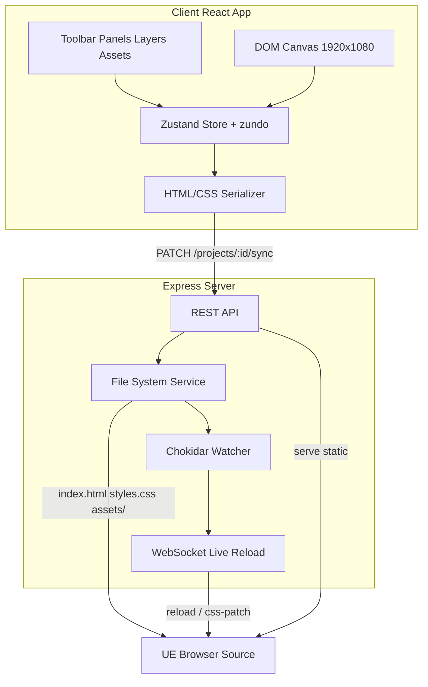

# План разработки Visual HTML Editor для Unreal Engine

## Контекст

Репозиторий [`D:/VSC/Html-editor`](D:/VSC/Html-editor) — пустой greenfield (только `.git`). Вся система строится с нуля.

**Зафиксированные решения:**
- Разрешение холста по умолчанию: **1920×1080**
- Анимации: **отложены** (v1 — статичный редактор; архитектура должна позволить добавить CSS animations позже)

---

## Ключевое архитектурное решение: DOM-based canvas

Вместо Fabric.js / Konva.js рекомендуется **редактирование реальных DOM-элементов** с библиотеками **[Moveable](https://github.com/daybrush/moveable)** + **[Selecto](https://github.com/daybrush/selecto)**:

| Критерий | DOM + Moveable | Fabric/Konva (canvas) |
|---|---|---|
| WYSIWYG | Буквальный — холст = HTML | Нужен маппинг canvas → HTML |
| Text / Video / GIF | Нативно в браузере | Сложный экспорт |
| CSS export | Сериализация DOM | Отдельный генератор |
| UE Live Preview | Прямая синхронизация | Дополнительный слой |
| 100–300 объектов | Достаточно (CSS `contain`) | Быстрее на 1000+ |

**Zustand** — единый store редактора. **zundo** (middleware) — Undo/Redo.



---

## Структура monorepo

```
Html-editor/
├── package.json                 # npm workspaces
├── .gitignore
├── README.md
├── packages/
│   ├── shared/                  # Общие типы и JSON Schema
│   │   └── src/
│   │       ├── types.ts         # Element, Project, Asset, Style
│   │       └── schema.ts        # Валидация project.json
│   ├── server/
│   │   └── src/
│   │       ├── index.ts
│   │       ├── routes/          # projects, assets, sync, preview
│   │       ├── services/
│   │       │   ├── projectService.ts
│   │       │   ├── assetService.ts
│   │       │   ├── exportService.ts   # project.json → HTML/CSS
│   │       │   └── importService.ts   # HTML/CSS → project.json
│   │       └── liveReload.ts    # WebSocket + chokidar
│   └── client/
│       └── src/
│           ├── App.tsx
│           ├── components/
│           │   ├── layout/      # AppShell, Sidebar, StatusBar
│           │   ├── canvas/      # Canvas, CanvasElement, Guides, Grid
│           │   ├── toolbar/     # Tools, ZoomControls
│           │   ├── panels/      # Layers, Properties, Assets
│           │   └── common/      # ColorPicker, NumberInput, etc.
│           ├── stores/
│           │   ├── editorStore.ts
│           │   ├── projectStore.ts
│           │   └── uiStore.ts
│           ├── engine/
│           │   ├── serializer.ts    # Store → HTML/CSS strings
│           │   ├── deserializer.ts  # HTML/CSS → Store
│           │   ├── snapEngine.ts
│           │   └── guidesEngine.ts
│           └── hooks/           # useHotkeys, useSync, useCanvasPanZoom
└── projects/                    # gitignored — рабочие проекты
    └── {projectId}/
        ├── project.json         # Source of truth
        ├── index.html           # Auto-generated
        ├── styles.css           # Auto-generated
        └── assets/
            ├── images/
            ├── videos/
            └── svg/
```

**Сборка:** Vite (client), tsx/ts-node (server), TypeScript strict mode. Зависимости — только npm, без CDN.

---

## Формат проекта (`project.json`)

Source of truth — JSON. HTML/CSS — производные файлы для UE.

```typescript
interface Project {
  version: "1.0";
  name: string;
  canvas: { width: 1920; height: 1080; background: string };
  elements: EditorElement[];   // ordered by z-index
  guides: Guide[];             // horizontal/vertical
  settings: { grid: GridSettings; snap: SnapSettings };
}

interface EditorElement {
  id: string;
  type: "text" | "image" | "gif" | "video" | "svg";
  name: string;                // Layer name
  locked: boolean;
  visible: boolean;
  style: ElementStyle;         // All CSS props as structured data
  content?: string;            // Text content
  assetId?: string;            // Reference to assets/
  customCss?: string;          // Raw CSS override block
}
```

**Принцип синхронизации:** любое изменение в store → debounced (300ms) PATCH на сервер → сервер обновляет `project.json` + регенерирует `index.html` / `styles.css` → chokidar → WebSocket → preview reload.

---

## Backend (Express)

**Порт:** `localhost:3000` (единая точка для редактора и UE preview).

### REST API

| Method | Route | Назначение |
|---|---|---|
| GET | `/api/projects` | Список проектов |
| POST | `/api/projects` | Создать (default 1920×1080) |
| GET | `/api/projects/:id` | Загрузить project.json |
| PATCH | `/api/projects/:id/sync` | Debounced sync от клиента |
| POST | `/api/projects/:id/import` | Импорт HTML/CSS/папки |
| GET/POST/DELETE | `/api/projects/:id/assets/*` | CRUD ресурсов |
| GET | `/preview/:id/*` | Static serve для UE |

### Live Reload

- В auto-generated `index.html` инжектится inline-скрипт (~30 строк), подключающийся к `ws://localhost:3000/live`.
- Сервер через **chokidar** следит за `projects/{id}/`.
- При изменении CSS — patch через `<link>` swap (без полного reload).
- При изменении HTML/assets — soft reload страницы.
- UE Web Browser Widget указывает на `http://localhost:3000/preview/{projectId}/`.

### Автосохранение

Клиент отправляет diff на сервер при каждом изменении (debounce 300ms). Сервер атомарно пишет файлы (`write temp → rename`). Отдельная кнопка Save не нужна — всё автоматически.

---

## Frontend: Layout редактора

```
┌──────────────────────────────────────────────────────────────┐
│  Toolbar: Select | Text | Image | Hand | Zoom +/- | Grid    │
├──────────┬───────────────────────────────────┬───────────────┤
│  Assets  │                                   │  Properties   │
│  Browser │         Canvas (1920×1080)        │  Panel        │
│          │         + Moveable handles        │               │
│  Layers  │         + Guides + Grid           │  Position     │
│  Panel   │         + Rulers                  │  Size         │
│          │                                   │  Style        │
│          │                                   │  Custom CSS   │
├──────────┴───────────────────────────────────┴───────────────┤
│  StatusBar: X, Y, W, H | Zoom % | Project name | Sync status │
└──────────────────────────────────────────────────────────────┘
```

---

## Canvas Engine

### Pan & Zoom
- **Zoom:** колёсико мыши (к курсору), кнопки, `Ctrl+0` fit, `Ctrl+1` 100%
- **Pan:** Space + drag или Hand tool (H)
- Реализация: CSS `transform: scale() translate()` на viewport-обёртке, холст остаётся 1920×1080

### Selection & Manipulation
- **Selecto** — marquee multi-select, `Ctrl+click` additive
- **Moveable** — drag, resize (8 handles), rotate (handle), snap
- **Snap targets:** grid, guides, edges/centers других элементов
- **Guides:** drag from rulers, magnetic snap, удаление двойным кликом

### Keyboard shortcuts (основные)

| Shortcut | Action |
|---|---|
| V | Select tool |
| T | Text tool |
| H | Hand (pan) |
| Del | Delete |
| Ctrl+C/V/D | Copy / Paste / Duplicate |
| Ctrl+Z/Y | Undo / Redo |
| Ctrl+A | Select all |
| Arrow keys | Nudge (1px), Shift+Arrow (10px) |
| Ctrl+G | Toggle grid |
| Ctrl+R | Toggle rulers |

---

## Элементы (v1)

### Text
- `<div contenteditable>` на холсте при редактировании, `<div>` в export
- Свойства: font-family, font-size, font-weight, line-height, color, text-align, letter-spacing

### Image / GIF
- `` с `src="assets/images/{filename}"`
- Crop через CSS `clip-path` или wrapper + `overflow:hidden` (сохраняется в style)
- Flip через `transform: scaleX(-1)` / `scaleY(-1)`
- Filters: `brightness()`, `contrast()`, `blur()` через CSS `filter`

### Video
- `<video autoplay loop muted playsinline>` — оптимально для UE overlay
- Свойства: object-fit, object-position

### SVG
- Inline SVG (import) или `` для external
- Fill/stroke через Properties panel (базовые)

---

## Assets Browser

Панель со списком всех файлов из `projects/{id}/assets/`:

- **Thumbnail grid** с типом (image/gif/video/svg)
- **Drag onto canvas** → создаёт элемент с `assetId`
- **Replace** — контекстное меню, swap `assetId` у выбранного элемента
- **Rename / Delete** — через API, при delete проверка ссылок
- **Upload** — drag & drop на панель или кнопка; файлы копируются в `assets/`

---

## Properties Panel

Группы свойств для выбранного элемента (или multi-select — общие свойства):

1. **Transform** — X, Y, W, H, Rotation, Opacity
2. **Appearance** — Background, Border, Border-radius, Box-shadow
3. **Text** (для text) — Font, Size, Weight, Line-height, Align, Color
4. **Media** (для image/video) — Object-fit, Object-position, Filters
5. **Layer** — Z-index, Name, Lock, Visible
6. **Custom CSS** — textarea с подсветкой синтаксиса (CodeMirror 6, bundled locally)

Все значения → structured `ElementStyle` в store → serializer → CSS class per element (`.el-{id}`).

---

## HTML/CSS Export (Serializer)

Каждый элемент → `<div class="el-{id}">` с absolute positioning:

```html
<!-- auto-generated index.html -->
<!DOCTYPE html>
<html>
<head>
  <link rel="stylesheet" href="styles.css">
  <!-- live reload script (only in dev/preview mode) -->
</head>
<body>
  <div id="overlay" style="width:1920px;height:1080px;position:relative;overflow:hidden;">
    <div class="el-abc123">Hello World</div>
    
    ...
  </div>
</body>
</html>
```

```css
/* auto-generated styles.css */
#overlay { background: transparent; }
.el-abc123 {
  position: absolute;
  left: 100px; top: 50px;
  width: 400px; height: 60px;
  font-size: 48px; color: #ffffff;
  ...
}
```

---

## Import Pipeline

1. **HTML + CSS** — парсинг через `node-html-parser` + CSS parser (`css-tree`); absolute-positioned элементы → `EditorElement[]`
2. **Папка проекта** — если есть `project.json` → load as-is; если только HTML/CSS → import pipeline
3. **Assets** — сканирование ``, `<video src>`, copy в `assets/`

Импорт не будет 100% perfect для произвольного HTML, но absolute-positioned overlay-разметка должна восстанавливаться корректно.

---

## Undo/Redo

- **zundo** middleware на Zustand store
- История: до 50 шагов
- Группировка: drag/resize → один шаг (debounce commit on pointerup)

---

## Производительность

- `React.memo` на `CanvasElement`
- CSS `contain: layout style paint` на элементах
- Snap/grid/guides вычисляются только во время drag (не на каждый render)
- Thumbnail generation для Assets — canvas resize при upload, кеш в `.thumbs/`
- Serializer работает на сервере (не блокирует UI)

---

## Фазы реализации

### Phase 1 — Foundation (MVP)
Scaffolding monorepo, Express API, React shell, DOM canvas 1920×1080, pan/zoom, один элемент Text + Image, drag/resize, Properties (position/size), serializer → HTML/CSS, Live Preview WebSocket.

### Phase 2 — Editor Core
Moveable rotate, multi-select (Selecto), snap (grid + elements), guides + rulers, Layers panel, Undo/Redo, hotkeys, copy/paste/delete, status bar с координатами.

### Phase 3 — Assets & Media
Assets Browser (upload, drag, rename, delete, replace), GIF + Video + SVG elements, image properties (opacity, filters, object-fit, flip), crop.

### Phase 4 — Styling & Import
Полная Properties panel (border, shadow, background, typography), Custom CSS editor, Import HTML/CSS/папки, project create/open/list UI.

### Phase 5 — Polish
Performance tuning (100+ elements), keyboard nudge, alignment tools (align left/center/right, distribute), context menus, welcome screen / project picker, README + docs.

---

## Зависимости (основные)

**Server:** express, cors, multer, chokidar, ws, node-html-parser, css-tree, uuid

**Client:** react, react-dom, zustand, zundo, moveable, selecto, @codemirror/lang-css, hotkeys-js

**Dev:** typescript, vite, concurrently, @types/*

Все — npm packages, без CDN, полностью offline после `npm install`.

---

## Запуск (целевой UX)

```bash
npm install
npm run dev        # concurrently: server :3000 + client :5173 (proxy)
# Editor: http://localhost:5173
# UE Preview: http://localhost:3000/preview/{projectId}/
```

Один процесс, одна рабочая папка, автосинхронизация — пользователь работает визуально, UE показывает результат в реальном времени.
